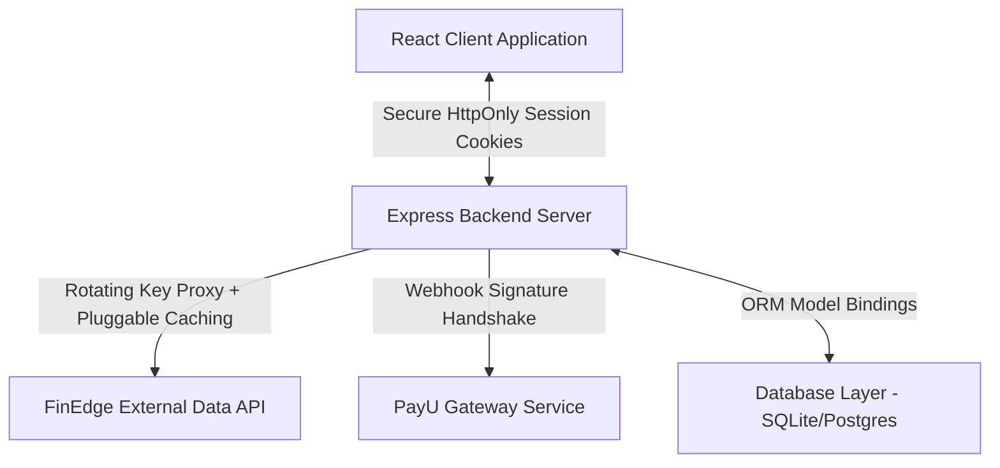

# FinScreen Monorepo ⚡

A high-performance, production-ready institutional stock screener and financial analytics platform. 

This repository is structured as an npm workspaces monorepo consisting of:
1. **`frontend/`**: Polymorphic React + Tailwind CSS v4 + Redux Saga client application compiled with Vite.
2. **`backend/`**: Node.js + Express + Prisma (SQLite/PostgreSQL) server offering secure institutional proxying and payment checkout webhooks.

---

## 🏗️ Architecture & Observations



### Key Technical Systems
* **Centralized Design System**: Semantically aligned typography tokens mapped to CSS properties (`src/theme/`) with native custom Tailwind v4 configuration classes.
* **API Proxy observer**: Exponential backoff request retry wrapper, active-promise concurrency deduplication registry, and pluggable memory/Redis TTL caching layer (`FinedgeService`).
* **Session Hardening**: Pure `httpOnly` secure session cookie-based authorization guard natively resolving tokens, completely eliminating `localStorage` XSS vectors.
* **Strict Payload Validations**: Zod schemas validating request parameters and bodies on all write endpoints.
* **Observability Boundaries**: Modular React Error Boundaries isolating localized component exceptions without crashing parent pages, integrated with Sentry monitoring hooks.
* **Full Testing Coverage**: Robust unit, integration, and performance assertion suites via Vitest, React Testing Library, and E2E browser automation.

---

## 🛠️ Installation & Setup

### Prerequisites
* **Node.js**: v20.x or higher
* **npm**: v10.x or higher

### 1. Environment Variables Configuration
Copy the monorepo-wide configuration seed `.env.example` to prepare both workspaces:
```bash
# Setup backend parameters
cp .env.example backend/.env

# Setup frontend parameters
cp .env.example frontend/.env.local
```

Configure respective parameters inside `backend/.env` (DB connections, secrets, keys) and `frontend/.env.local` (Vite APIs url).

### 2. Database Migrations Initialization
Synchronize ORM schemas and seed offline listings databases:
```bash
# Generate Prisma Client models
npm run prisma:generate --workspace=backend

# Run Prisma schema migrations
npm run prisma:migrate --workspace=backend
```

---

## 🚀 Running the Monorepo

You can run monorepo scripts directly from the workspace root directory:

### Development Dev Server
```bash
# Spin up both backend (port 5000) and frontend (port 3000) concurrently
npm run dev

# Or spin them up individually
npm run dev:backend
npm run dev:frontend
```

### Testing Suites
```bash
# Run all frontend and backend Vitest test suites
npm run test

# Run frontend tests with jsdom environments specifically
npm run test:frontend

# Run backend tests specifically
npm run test:backend
```

### Production Asset Compilations
```bash
# Compile and build clean distributions for both workspaces
npm run build
```

### Quality Audits & Formatting
```bash
# Lint codebases across all workspaces
npm run lint

# Auto-fix linting issues and enforce Prettier formatting
npm run format
```

---

## 🔒 Security Best Practices
* **Zero Secret Commits**: Documented examples must reside in `.env.example`. Any local environment adjustments must reside inside `.env` or `.env.local` which are strictly untracked by `.gitignore`.
* **Pluggable database migrations**: In production, modify `backend/prisma/schema.prisma` datasource block to use `"postgresql"` and swap `DATABASE_URL` connection strings in `backend/.env` without editing any TS code.
